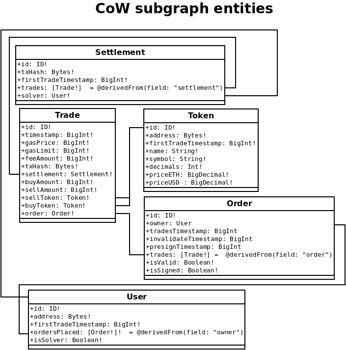

# CoW-subgraph

Implements a subgraph for the CoW Protocol 

*So far this is a work in progress.*

It's working on mainnet, rinkeby and gnosis chain network.

## Available entities



### Settlement entity notes

So far settlements are being created using txHash as ID and that hash is creating the relation between Settlement and Trade entities.

### Orders entity notes

Notice order entity has 3 different timestamps. Each timestamp will be filled depending on the entry point that order passed.

**Entrypoints are:**

- On trade event
- On invalidate order event
- On pre sign event

## Some links

- Docs about Cowswap: https://docs.cowswap.exchange/
- GP v2 contracts repo: https://github.com/gnosis/gp-v2-contracts/
- Mainnet deployment on hosted service: https://thegraph.com/hosted-service/subgraph/gnosis/cow
- There is also a GP v1 subgraph here: https://github.com/gnosis/dex-subgraph

## Setup

*Requisites:* You must have access to a console and have yarn installed. More info about [yarn](https://classic.yarnpkg.com/lang/en/docs/)


1.- Install The Graph CLI globally as suggested in The Graph [docs](https://thegraph.com/docs/en/developer/quick-start/) by running the following:

```
$ yarn global add @graphprotocol/graph-cli
```

2.- Clone this repo and install the dependencies by executing:

```
$ yarn
```

3.- Go to The Graph [hosted service](https://thegraph.com/hosted-service/dashboard) and log in using your github credentials. 

4.- Copy your access token and run the following

```
$ graph auth --product hosted-service <YourAccessToken>
```

5.- Using your browser create a new subgraph in the dashboard by clicking "Add Subgraph" button and complete the form. Notice your subgraph will be named as the following: "YourGithubAccount/SubgraphName"

6.- Edit the package.json file using your favorite editor. Replace <YourGithubUser/YourSubgraph> with the value obtained in the previous step. Replace <Network> field too with the desired network you want to deploy, ```mainnet``` for ethereum mainnet, ```rinkeby``` for ethereum rinkeby or ```gc``` for gnosis chain. (Remove the "<" and the ">" characters)

7.- Execute the following commands:
```
$ yarn deploy:dev
```

If everything went well you'll have a copy of this subgraph running on your hosted service account indexing your desired network.

Please notice a subgraph can only index a single network, if you want to index another network you should create a new sugraph and do same steps starting from step 3.

---------

If you have any suggestion about this work feel free to create a task or a pull request with your own changes to be considered. 

Mooooh!
